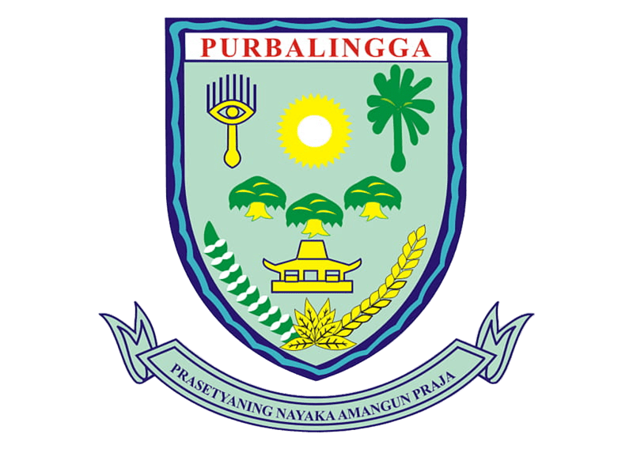

<div align="center">
  
  <h1>🌍 Banyumas GIS Portal untuk UMKM</h1>
  <p>
    <strong>Sistem Informasi Geografis Terpadu & Portal Manajemen UMKM Berbasis Enterprise</strong>
  </p>
  <p>
    <a href="#-fitur-unggulan">Fitur Unggulan</a> •
    <a href="#-arsitektur--teknologi">Arsitektur</a> •
    <a href="#-panduan-instalasi">Instalasi</a> •
    <a href="#-struktur-proyek">Struktur Proyek</a>
  </p>
</div>

---

## 🚀 Gambaran Umum

**Banyumas GIS Portal** adalah platform *Enterprise Software-as-a-Service (SaaS)* yang dirancang secara spesifik untuk memetakan, memvalidasi, dan mengekspos potensi Usaha Mikro, Kecil, dan Menengah (UMKM) di wilayah Kabupaten Banyumas. 

Platform ini menjembatani tiga entitas utama: **Pemerintah (Dinas)** sebagai pengawas regulasi, **Pemilik UMKM** sebagai pengelola bisnis, dan **Masyarakat Umum (Konsumen)** sebagai pengguna akhir, melalui antarmuka peta interaktif berkinerja tinggi dan sistem *dashboard* administratif yang komprehensif.

## ✨ Fitur Unggulan

### 🗺️ Pemetaan Spasial Tingkat Lanjut (Active GIS)
- **Dynamic Clustering**: Visualisasi ribuan titik koordinat UMKM tanpa mengorbankan performa *browser* menggunakan `react-leaflet-cluster`.
- **Geospatial Filtering**: Pencarian UMKM berdasarkan poligon administratif (Kecamatan/Desa) dengan akurasi tinggi didukung algoritma `Turf.js`.
- **Native-Like Mobile Experience**: Navigasi peta pada perangkat seluler menggunakan pola UI *Bottom Sheet* yang mulus dan interaktif.

### 🛡️ Sistem Keamanan & Autentikasi (Enterprise-Grade)
- **Role-Based Access Control (RBAC)**: Pemisahan hak akses secara presisi (*Super Admin*, *Admin Dinas*, dan *Pemilik UMKM*) terintegrasi langsung dengan lapisan otorisasi database PostgreSQL.
- **Edge Rate Limiting**: Proteksi proaktif terhadap serangan *brute force* dan trafik abnormal menggunakan *Sliding Window Rate Limiter* via Upstash Redis di level *Middleware*.

### 📱 UI/UX Modern & Responsif
- **Glassmorphism & Micro-Interactions**: Penggunaan desain antarmuka modern berbantuan *Framer Motion* untuk memberikan *feedback* visual berkualitas tinggi.
- **Optimasi Media Pintar**: Pengelolaan dan pemrosesan gambar UMKM secara instan menggunakan infrastruktur *Cloudinary API*.

---

## 🛠 Arsitektur & Teknologi

Sistem ini direkayasa menggunakan teknologi *open-source* modern standar industri:

**Frontend Ecosystem:**
- **Framework**: Next.js 16 (App Router)
- **Library**: React 19, TypeScript
- **Styling**: Tailwind CSS v4, Class Variance Authority (CVA)
- **Animasi & Interaksi**: Framer Motion, Radix UI Primitives (Shadcn)

**GIS & Pemetaan:**
- **Core Engine**: Leaflet & React-Leaflet
- **Geospatial Analysis**: Turf.js (`@turf/union`, `@turf/boolean-point-in-polygon`)

**Backend, Database & DevOps:**
- **BaaS (Backend as a Service)**: Supabase (PostgreSQL, GoTrue Auth, Row Level Security)
- **Caching & Security**: Upstash Redis Serverless
- **Media Storage**: Cloudinary

---

## 💻 Panduan Instalasi

Ikuti langkah-langkah di bawah ini untuk menjalankan proyek secara lokal (*Development Environment*).

### 1. Prasyarat Sistem
Pastikan perangkat Anda telah menginstal:
- Node.js (Versi 20.x atau lebih baru disarankan)
- Git
- Akun Supabase, Upstash, dan Cloudinary aktif (untuk konfigurasi environment).

### 2. Kloning Repositori
```bash
git clone https://github.com/MattYudha/Purbalingga-UMKM-.git
cd Purbalingga-UMKM-
```

### 3. Instalasi Dependensi
```bash
npm install
# atau
yarn install
# atau
pnpm install
```

### 4. Konfigurasi Environment Variables
Gandakan berkas referensi `.env` dan isi dengan kredensial API Anda.
```bash
cp .env.local.example .env.local
```
Variabel yang diwajibkan:
```env
NEXT_PUBLIC_SUPABASE_URL=your_supabase_url
NEXT_PUBLIC_SUPABASE_ANON_KEY=your_supabase_anon_key

UPSTASH_REDIS_REST_URL=your_upstash_url
UPSTASH_REDIS_REST_TOKEN=your_upstash_token

CLOUDINARY_URL=your_cloudinary_url
```

### 5. Menjalankan Development Server
```bash
npm run dev
```
Akses `http://localhost:3000` di *browser* Anda untuk melihat aplikasi berjalan. Halaman akan dimuat ulang secara otomatis setiap Anda melakukan perubahan pada kode.

---

## 📁 Struktur Proyek (Ringkasan)

```text
├── public/                 # Aset statis, GeoJSON batas wilayah, dan gambar/logo
├── src/
│   ├── app/                # Next.js App Router (Halaman Utama, Admin, API Routes)
│   ├── components/         # Komponen UI Reusable (Layout, Peta, Dialog, Auth)
│   │   ├── auth/           # Modul spesifik Autentikasi (MobileAuthSheet, dll)
│   │   ├── dashboard/      # Panel Manajemen (CMS)
│   │   ├── map/            # Mesin Render Peta Leaflet & Overlay
│   │   └── ui/             # Komponen primitif Shadcn UI
│   ├── lib/                # Konfigurasi Library Eksternal (Supabase, Utils)
│   └── scripts/            # Skrip Pemrosesan Data & Migrasi Database
├── package.json            # Daftar dependensi dan scripts NPM
└── middleware.ts / proxy.ts # Logika keamanan *Edge* & Rate Limiting
```

---

<div align="center">
  <p>Diciptakan dengan visi untuk mempercepat pertumbuhan ekonomi digital di Kabupaten Banyumas.</p>
  <p><strong>© 2026 Pemerintah Kabupaten Banyumas</strong></p>
</div>
